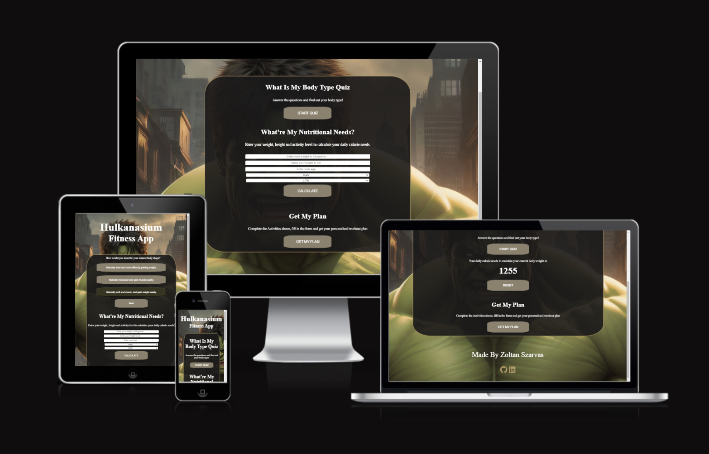

## Introduction

Hi there, 

Hulkanasium is a fictional fitness app created as the second Milestone Project for my studies with CodeInstitute. 

The idea of the site similarly to my first project is based on real life experience. The name Hulkanasium is fictional name my collegues and I come up with for a basement gym we had at a Hotel we all worked together in. The gym had a large Hulk picture in the middle that inspired the name. The second project of the web applications course requires the implementation of JavaSript along with html and css as it was in the previous project. To fulfill the requirement I decided to bring Hulkanasium alive and design a fitness application for it, where users can complete a quiz to find out their body type along with a calorie calculator and a form field to get a workout plan based on their results.

## **[Hulkanasium Live Site](https://zoltanszarvas0209.github.io/mp2_hulkanasium/)**

## **[Repository](https://github.com/ZoltanSzarvas0209/mp2_hulkanasium.git)**

## Table of contents

 1. [ UX ](#ux)
 2. [ Technologies and Tools ](#technologies)  
 3. [ Objective ](#objective)  
 4. [ Research ](#research) 
 5. [ Target Audience ](#audience)  
 6. [ User Stories ](#user)
 7. [ Structure and Design ](#design)
     - [ Layout ](#layout)
     - [ Features ](#features)
     - [ Design Choices ](#designchoice)
     - [ Wireframes ](#wireframes)
 9. [ Deployment ](#deployment)
 10. [ Testing/Bugs/Fixes ](#testing)
     - [ HTML,CSS and JS Validation](#htmlandcss)
     - [ Manual Testing ](#alltesting)
          - [ Pre-deployment ](#predeployment)
          - [ post-deployment ](#postdeployment)
     - [ User Testing ](#usertest)
     - [ Accessibility ](#access)
 11. [ Media ](#media)
 12. [ Credits ](#credit)  

## UX 

The methology of UXD was used in the planning and development of the project. 
The choosen project is a fictional gym webapp that mimics some features of an ordinary webapp along with some added features to showcase use of JavaScript within the project. 

### Technologies and Tools Used 

* Languages

    * HTML
    * CSS
    * JavaScript

* Version Control

    * Git
    * Github
    * Gitpod

* Additional resources

    * Coolors: https://coolors.co/ 
    * FontAwesome: https://fontawesome.com/search?o=r&m=free&s=solid
    * Perplexity: perplexity.ai
    * ChatGPT: https://chat.openai.com/
    * Google Fonts: https://fonts.google.com/
    * W3School: https://www.w3schools.com/

* Testing

    * Google Lighthouse
    * JSHint: https://jshint.com/
    * JSLint: https://www.jslint.com/
    * W3C HTML Validator: https://validator.w3.org/
    * W3C CSS Validator: https://jigsaw.w3.org/css-validator/

### Objective 
    * The objectives of the app is to promote health lifestyle and advertise the fictional gym Hulkanasium. Furthermore , the app is intended to be a tool for users to gain some general knowledge about their body type and nutrition needs.

### Research 

Extensive research took place before starting on the planing of the structure of the site. Visited several existing gym sites to find inspiration in design, test usability and find what is needed to fulfill user needs.

While the original idea was to develop a complete webpage , this was scrapped and changed to a fitness app as I found it fulfills the requirements for my second milestone project better.

During my research I focused on finding what most people would be comfortable with and came to realise that calorie intake is the basic "go to" when it comes to gaining/losing weight. I also figured that knowing "what you are" in terms of your body type is a must to be able to create specialised plans and therefore decided to implement these features.

Websites visited for research:

* [PureGym](https://www.puregym.com/)
* [Nuffield Helath](https://www.nuffieldhealth.com/gyms/bristol)
* [Healthline](https://www.healthline.com/health/quiz/quiz-whats-your-body-type)
* [Bodybuilding](https://www.bodybuilding.com/fun/macronutcal.htm)

### Target Audience 

The target audiance of the application is very broad. IT aims to help all looking to get fitter with the first steps. wether it is commiting to a plan or just starting to watch what you eat. Generally it includes people looking to lose weight as well as fitness enthusiasts looking to gain muscle. The app also helpful to anyone that just wants to find out the "numbers" and be more aware of their eating habbits.

### User Stories 

* User story 1:

    - As a user looking to lose weight and therefore find out nutritional needs:
        1. I want to find out what is my daily calorie need.
        2. I want to find out how it changes based on my activity level.
        3. I want to be able to get in touch to find out more.

* User story 2:

    - As a gym enthusiast I am looking to gain more understanding of my body:
        1. I want to find out my body type to understand my training needs better
        2. I want to know my nutritional needs to help with diet
        3. I want to improve and get a personalised workout plan

### Structure and Design 

## Layout: 

I designed the app to be a simple 1 page site with all information presented straight away. The page breaks into 3 section with a simple structure of Header - Body - 
Footer.
- The header simple features the name of the app.
- The body is the main section of the project and it contains all interactive elements of the fitness app and therefore it can be broken down to 3 subsection:
    1. Body Type Quiz
    2. Calorie Calculator
    3. Get my plan
The 3 sections of the app was designed to fulfill the user stories of this simple app.
- The footer displays the author and the social links associated with me.

## Design Chices: 

* Color Palette:   

The above color palette where generated using https://coolors.co/ free color generator and the background image of the application. I'va added a generic white color to use for text to provide a strong contrast with the scheme.

* Font-family:

 I choose Roboto Serif font-family with sans-seif as a fallback option.

## Features: 

1. Header

Header

2. Main Page and background

 MainPage
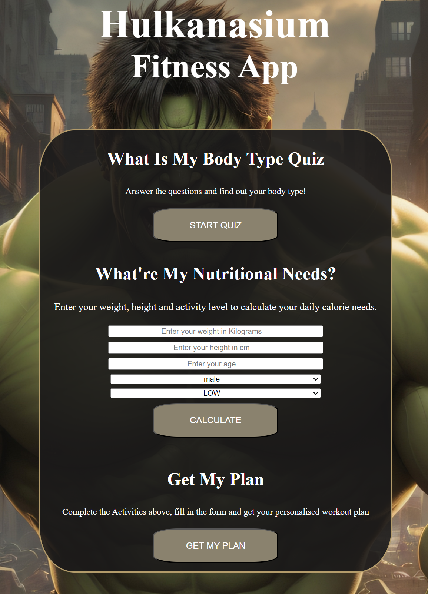

3. Body Type Quiz
    1. Quiz

 Quiz default 
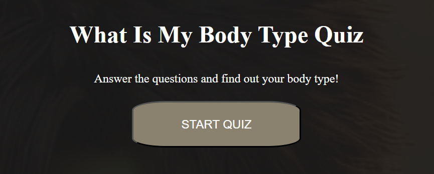

    2. Navigation

 Quiz Questions 
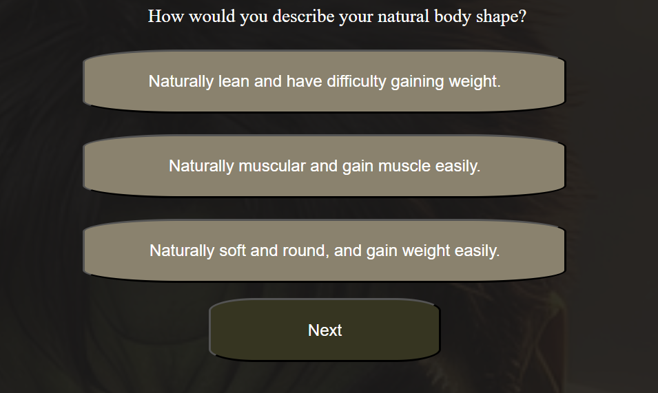

    3. Dynamic content

 Quiz functions 
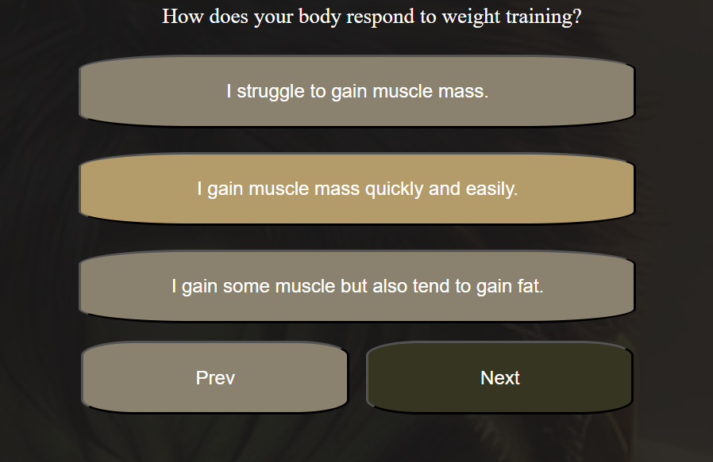

4. Calorie Calculator
    1. Main 

 Calculator default 
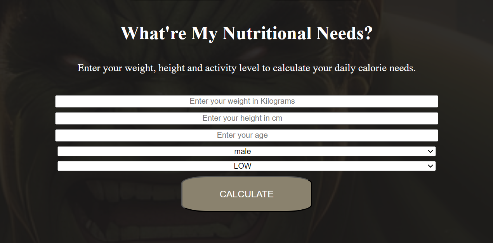

    2. Dynamic content

 Calculator result 
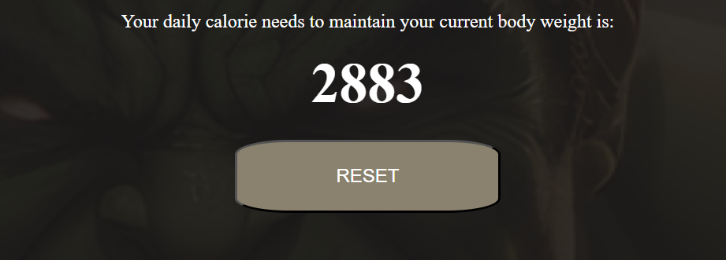

5. Get My Plan
    1. Start screen

 Get My Plan default 
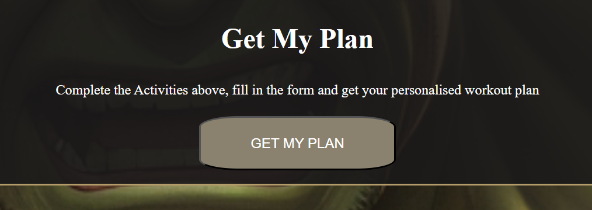

    2. Pop-up form

 Pop-up form 
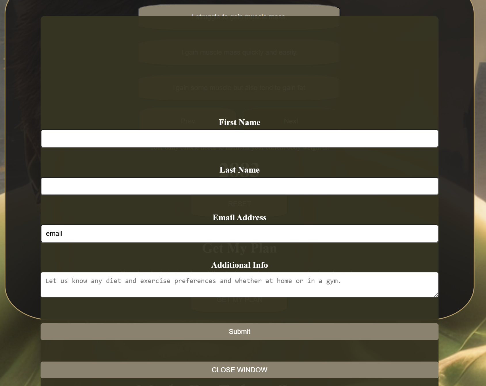

    2. Thank you page

 Thank you pop up 
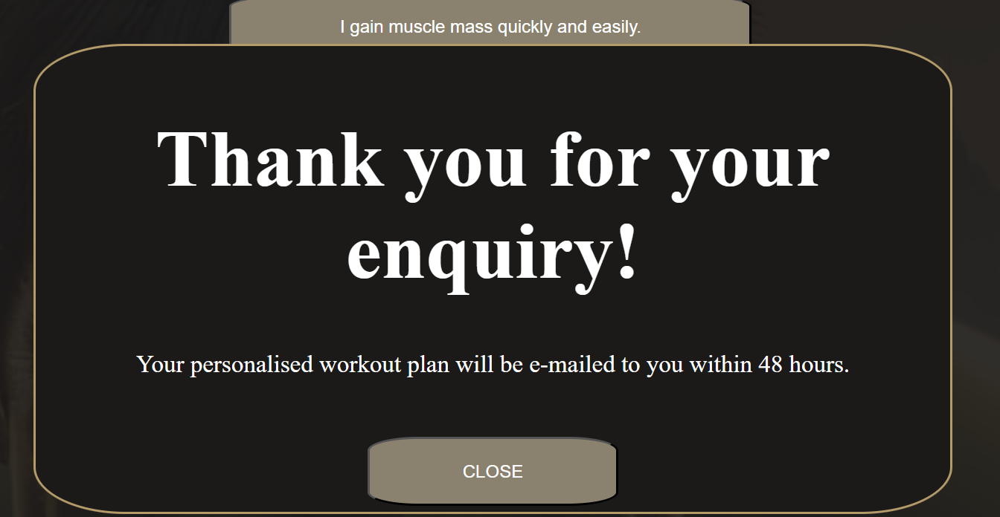

6. General UX features.
    1. Interactive buttons
    2. Visual feedback features
7. Footer

 footer 

## Wireframes: 

The original wireframes had a slightly different lay out then the final product. While initially planning the app I accounted for issues with the appearence of the features in different screen sizes. However, once code-ing started and I had the visuals in front of me I was happy with how it looked and decided there was no need to make mayor adjustments and therefore the layout stays the same consistently.

    - Few other adjustment were made during development:
        1. extended the form section of the Calorie Calculator section with additional input field and dropdown menu.
        2. decresed the amount of choices available for each multiple choice question.
        3. included a textarea in the Get My Plan section for the user to be able to write custome messages.
        4. scraped the seperate Get My Plan page idea and replaced it with a pop-up form

-   

 Wireframes: Home Default 

    
    

-   

 Wireframes: Home Active 

    
    

-   

 Wireframes: Get My Plan 

    
    

### Deployment 

To Deploy a project from your github repesatory, follow the steps below.

 1. Login to your GitHub account.
 2. Click on the repository you would like to deploy.
 3. Clcik Settings on the top navigation bar. 
 4. Then select Pages on the side navigation bar.
 5. Under Build and Deployment/ Source click on the first dropdown menu and select Deploy from a branch.
 6. Under branch click the first dropdown menu and select main.
 7. Under the second dropdown menu select /(root).
 8. Select Save.

    The github page now is alive!.

## Testing/Bugs/Fixes 

### HTML,CSS and JS validation: 

1.  HTML validation: W3C validator was used to do this.
    There was a number of issues highlghted initially. Errors were caused by placeholders placed on select elements and unallowed target atrbute used in anchor tags.
    I had couple of warnings relating to script elements having type attribute. I cleared all the forementined and the validation passed with no warnings.
    
-   
 
 Initial validation errors 

    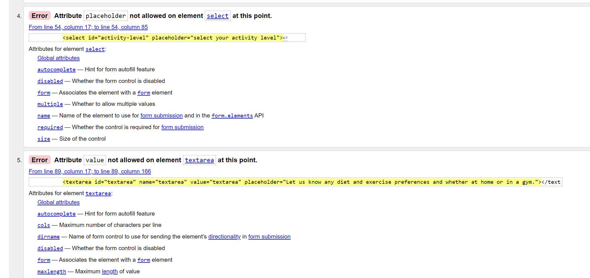
    

-   
 
 Initial validation warning 

    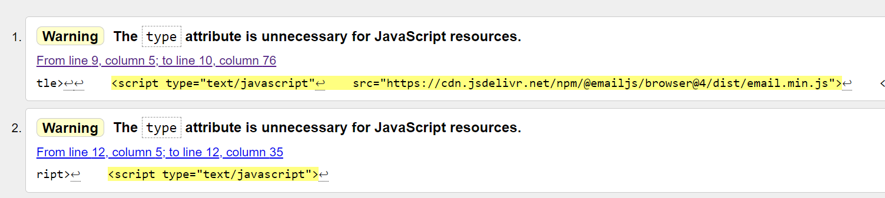
    

-   
 
 PASSED VALIDATION 

    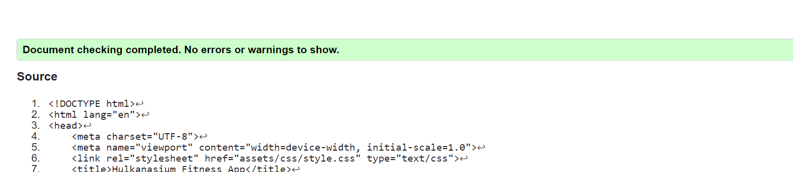
    

2. CSS validation: W£C validator was used and code passed straight away.

-   
 
 PASSED VALIDATION 

    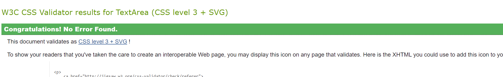
    

3. JavaScript validation: I  ran the code through https://jshint.com/ to validate my javascript. There were no errors , however high number of warnings were issued.
    Investigating the warning I found that most relates to javascript versions and had no effect on the application so I decided not to address them. Further issue were due to missing or unneccessary semicolons, all of which had been replaced or cleared accordingly. Finally had several warning relating to unused variables. I found that these are due to accessibility by the software as the each js file were tested seperately. 

    I also ran the code using JSLint. IT has highlighted other warnings such as lines longer than 80 character, undeclared 'documents' and use double quotes instead of singles. I did some research on the warnings highlighted and found that the 80 character lenght is a convention that dates back to punch cards and there is no hard limit in modern practises. I have modified some of my single line comment into doubles to decrese the warnings. I also found that single quotes warnings are highlighted because of SQL and JSON compatibility and JavaScript guideline do recommend using double quotes which also ensures consistency. I have modified my code after my findings. Finally, high number of warnings due to undeclared 'document' which was mitigated using the code /*jslint browser:true */ to enable browser enviroment.

-   
 
 JSHint Quiz VALIDATION 

    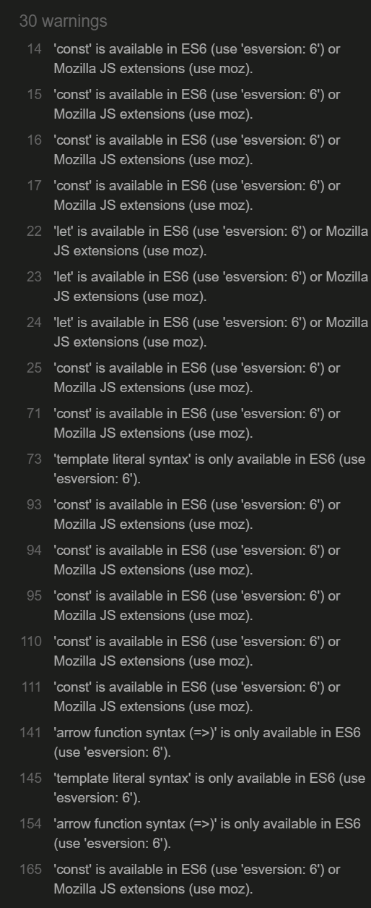
    

-   
 
 JSHint Calculator VALIDATION 

    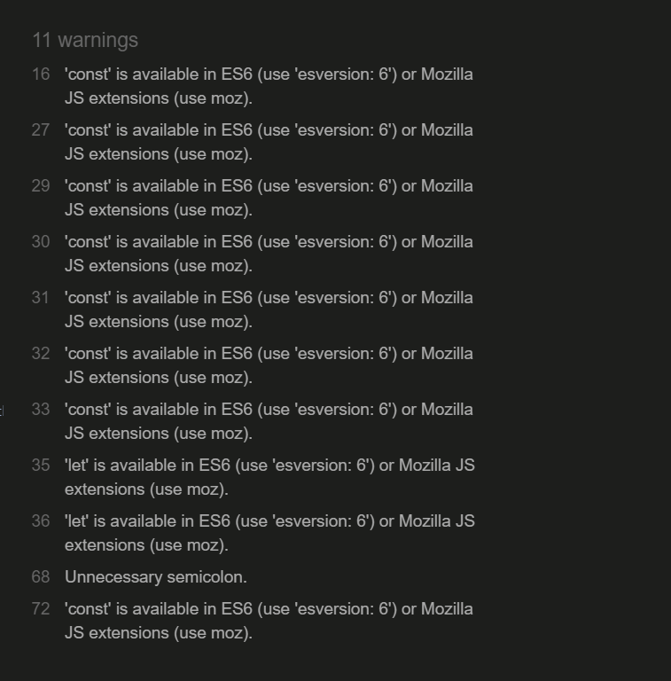
    

-   
 
 JSHint GetMyPlan VALIDATION 

    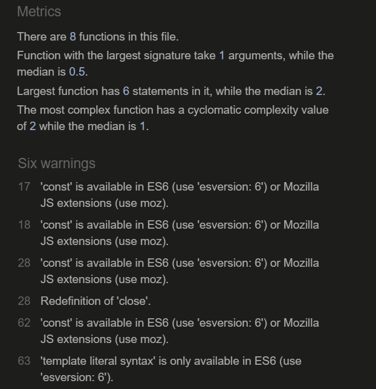
    

-   
 
 JSLint Quiz VALIDATION 

    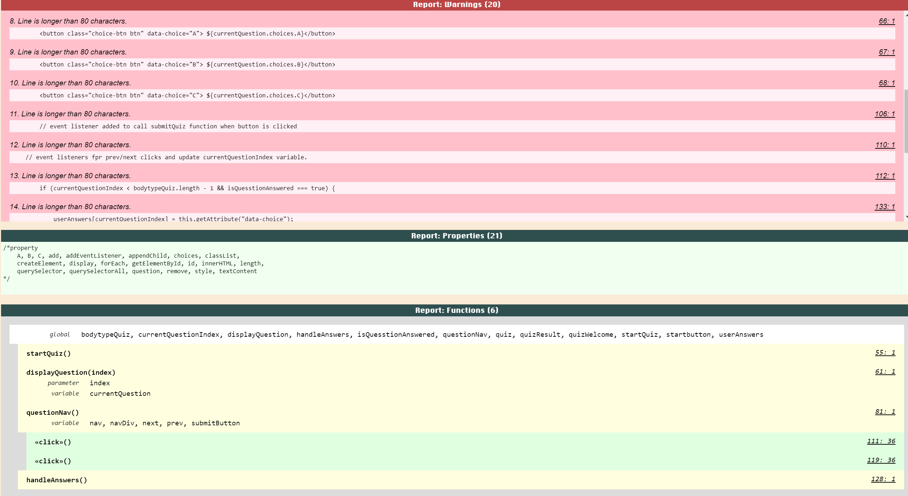
    

-   
 
 JSLint Calculator VALIDATION 

    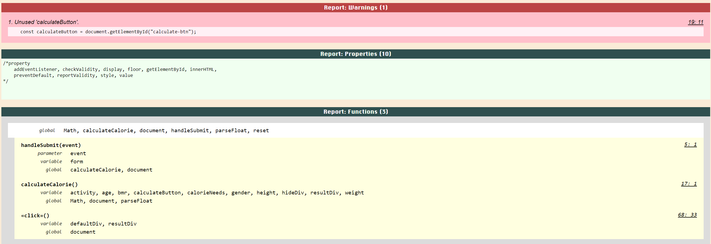
    

-   
 
 JSLint GetMyPlan VALIDATION 

    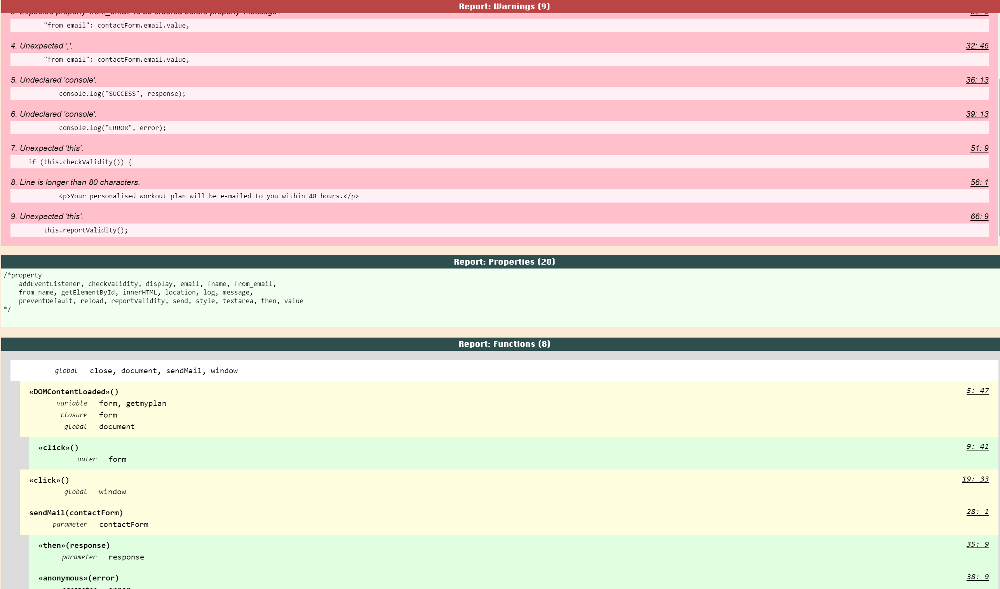
    

### Manual Testing 

#### Initial testing items below arose during development and most were dealt with at the time.  

## RESPONSIVENESS

| **Feature** | **Test Method** | **Expectation** | **Outcome** |
|-------------|-----------------|-----------------|-------------|
| Header Responsivness | Developer Tools: 320px/375px/425px/768px/1024px/1440px | Fully Responsive Layout | PASS |
| Footer Responsiveness | Developer Tools: 320px/375px/425px/768px/1024px/1440px | Fully Responsive LAyout| PASS |
| Main Container Responsiveness | Developer Tools: 320px/375px/425px/768px/1024px/1440px | Fully Responsive LAyout| PASS |
| Body Type Quiz Responsiveness | Developer Tools: 320px/375px/425px/768px/1024px/1440px | Fully Responsive LAyout| FAIL(1) |
| Calorie Calculator Responsiveness | Developer Tools: 320px/375px/425px/768px/1024px/1440px | Fully Responsive LAyout| PASS |
| Get My Plan-Pop-up Responsiveness | Developer Tools: 320px/375px/425px/768px/1024px/1440px | Fully Responsive LAyout| PASS |

## Buttons functionality

| **Feature** | **Test Method** | **Expectation** | **Outcome** |
|-------------|-----------------|-----------------|-------------|
| Navigation-Start Quiz | Click button | Button to trigger action as expected | PASS |
| Navigation-Quiz page1 next | Click button | Button to trigger action as expected | PASS |
| Navigation-Quiz page1 next | Click button | Button to trigger action as expected | PASS |
| Navigation-Quiz page2 next | Click button | Button to trigger action as expected | PASS |
| Navigation-Quiz page2 prev | Click button | Button to trigger action as expected | PASS |
| Navigation-Quiz page3 next | Click button | Button to trigger action as expected | PASS |
| Navigation-Quiz page3 prev | Click button | Button to trigger action as expected | PASS |
| Navigation-Quiz page4 next | Click button | Button to trigger action as expected | PASS |
| Navigation-Quiz page4 prev | Click button | Button to trigger action as expected | PASS |
| Navigation-Quiz page5 submit | Click button | Button to trigger action as expected | PASS |
| Navigation-Quiz page5 prev | Click button | Button to trigger action as expected | PASS |
| Navigation-Result restart | Click button | Button to trigger action as expected | FAIL(4,7) |
| Navigation-Calculate button | Click button | Button to trigger action as expected | FAIL(5) |
| Navigation-Calculate reset | Click button | Button to trigger action as expected | PASS |
| Navigation-Get My Plan button | Click button | Button to trigger action as expected | PASS |
| Navigation-Pop-Up close button | Click button | Button to trigger action as expected | PASS |
| Navigation-Pop-up submit button | Click button | Button to trigger action as expected | PASS |
| Navigation-Thank you page reset | Click button | Button to trigger action as expected | PASS |

## Buttons appearence

| **Feature** | **Test Method** | **Expectation** | **Outcome** |
|-------------|-----------------|-----------------|-------------|
| Navigation-Start Quiz | Click button | Button to trigger action as expected | PASS |
| Navigation-Quiz page1 next | Click button | Button to trigger action as expected | PASS |
| Navigation-Quiz page1 next | Click button | Button to trigger action as expected | PASS |
| Navigation-Quiz page2 next | Click button | Button to trigger action as expected | PASS |
| Navigation-Quiz page2 prev | Click button | Button to trigger action as expected | PASS |
| Navigation-Quiz page3 next | Click button | Button to trigger action as expected | PASS |
| Navigation-Quiz page3 prev | Click button | Button to trigger action as expected | PASS |
| Navigation-Quiz page4 next | Click button | Button to trigger action as expected | PASS |
| Navigation-Quiz page4 prev | Click button | Button to trigger action as expected | PASS |
| Navigation-Quiz page5 submit | Click button | Button to trigger action as expected | FAIL(2) |
| Navigation-Quiz page5 prev | Click button | Button to trigger action as expected | PASS |
| Navigation-Result restart | Click button | Button to trigger action as expected | PASS |
| Navigation-Calculate button | Click button | Button to trigger action as expected | PASS |
| Navigation-Calculate reset | Click button | Button to trigger action as expected | PASS |
| Navigation-Get My Plan button | Click button | Button to trigger action as expected | PASS |
| Navigation-Pop-Up close button | Click button | Button to trigger action as expected | PASS |
| Navigation-Pop-up submit button | Click button | Button to trigger action as expected | PASS |
| Navigation-Thank you page reset | Click button | Button to trigger action as expected | PASS |

## Layout

| **Feature** | **Test Method** | **Expectation** | **Outcome** |
|-------------|-----------------|-----------------|-------------|
| Layout header | visual inspection | page/feature to appear as expected/designed | PASS |
| Layout main page/background | visual inspection | page/feature to appear as expected/designed | FAIL(3) |
| Layout Body Type Quiz start | visual inspection | page/feature to appear as expected/designed | PASS |
| Layout Body Type Quiz page 1 - 5 | visual inspection | page/feature to appear as expected/designed | PASS |
| Layout Body Type Quiz result | visual inspection | page/feature to appear as expected/designed | PASS |
| Layout Calculator start | visual inspection | page/feature to appear as expected/designed | PASS |
| Layout Calculator result | visual inspection | page/feature to appear as expected/designed | PASS |
| Layout Get My Plan start | visual inspection | page/feature to appear as expected/designed | PASS |
| Layout Get My Plan-Pop up | visual inspection | page/feature to appear as expected/designed | PASS |
| Layout Get My Plan- Thank you pop up | visual inspection | page/feature to appear as expected/designed | FAIL(6) |

 - Issues found during testing pre-deployment listed below:

 1. Quiz questions over extend when expanding onto tablet screen size( 768px) and overflow their container box. 
    - Investigating the issue with the help of Developer Tools I found that the media queries originally written to avoid this problem were insufficient.   
    I adjusted the code and the issue was resolved.

    

 Sceenshot of the problem: 

    
    
 

 2. On the last page of the quiz a dynamically submit button appears that do not macth the UX design pattern and does not appear darkened out(giving feedback to the user 
    that it can not yet be clicked).
    - The issue was fixed by adding the "selected" css class to the button when created and then removed again when an answer is selected. This coused further issues at first with the background color not behaving as expected and additional event listeners were added to fix the newly arrisen issue.

    

 Sceenshot of the problem: 

    
    
 

 3. The main container appers to be slightly out of alignment and the edge of the repeating background picture can be seen.
    - With the help of Developer Tools I found a pre-set margin of 8px was pushing the content out of alignment. I updated the css file to include a margin: 0px;
    for the body element. This resolved the alignment issue.

    

 Sceenshot of the problem: 

    
    
 
    

 Sceenshot of the problem: 

    
    

 4. Found that while the reset button provided for the quiz is taking you back to the quiz as expected, it land on the last question insted of the first.
    - Investigated the issue and found that the quiz related variables were not reseted at the time of clicking the button.
    The following code was added to reset all neccessary variables: currentQuestionIndex = 0, userAnswers = [], isQuesstionAnswered = false;

 5. The Calorie Calculator's Calculate button would not work as expected. While the output was what I wanted, validation was an issue.
    - The original implementation had the input fields and dropdown menus embedded individually rathen than part of a form. That made html validation impossible.   
    To resolve this problem, I adjusted the html and included a form element that now had all required fields added. After the html validation was in place an event listener was attached to the Calculate Button to prevent defult action until the custom function written is carried out.
    The above changed resolved the issue.

 6. Thank you pop up page goes out of alignment on large screen sizes( larger than 1134px). 
    - I fixed the issue with media quires and making the element's position absolute.

    

 Sceenshot of the problem: 

    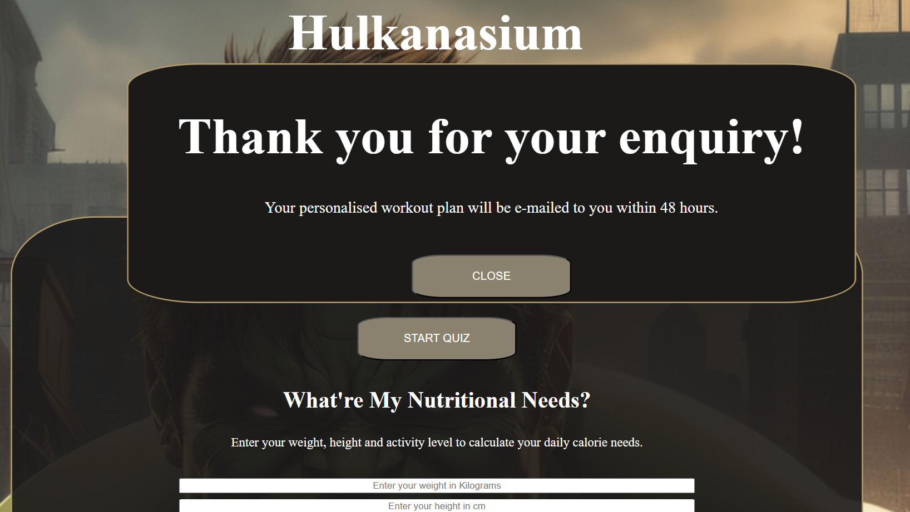
    
 

 7. Restart button dosen't hide the result page , but places the quiz above it.
    - the following code was added to the reset function triggered by an eventlistener: quizResult.style.display = "none"; this has resolved the issue.

    

 Sceenshot of the problem: 

    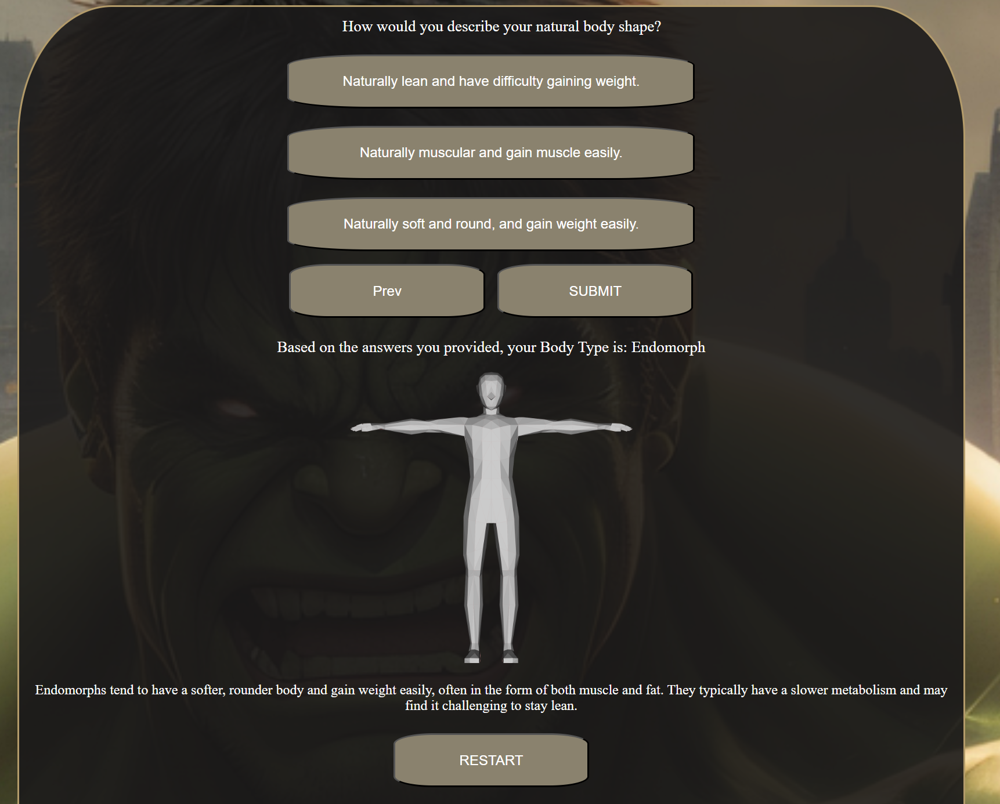
    
   

#### At the end of the Project further testing took place to identify any shortcomings. See details below: 

| **Feature** | **Test Method** | **Expectation** | **Outcome** |
|-------------|-----------------|-----------------|-------------|
| | | | |

#### User Testing 

* A total of 10 friends and family members were asked to use each feature of the app.
The following features were tested: Quiz , Calorie Calculator, Get My Plan e-mail and social links.

| **Feature** | **No Users** | **Results** |
|-------------|--------------|-------------|
| 5 | 10 | 100% |

1. The result of the testing was 100% succesful.
2. Further feedback was taken from participant and the following was highlighted: Positioning of the pop - up form is inadequate. This was addressed and adjusted.

* Testing User stories:

    1. User story 1:

        - As a user looking to lose weight and therefore find out nutritional needs:
            1. I want to find out what is my daily calorie need.
            - The user is immediatelly presented with a calorie calculator with empty fields.
            - Easy to use self explanatory feature, with a calculate button that highlight when hovered over.
            - Validation in place stops the user submiting the form with missing fields.

            2. I want to find out how it changes based on my activity level.
            - The form contains a dropdown menu, clearly marked as Activity level.
            - there are 3 options here: low,moderate and high.
            - Each time the calculate button is pressed the result is presented along with a reset button so the user can easily use the feature again.

            3. I want to be able to get in touch to find out more.
            - The get my plan section is giving the users a feature to send messages.

    - 

 Image for user story 

        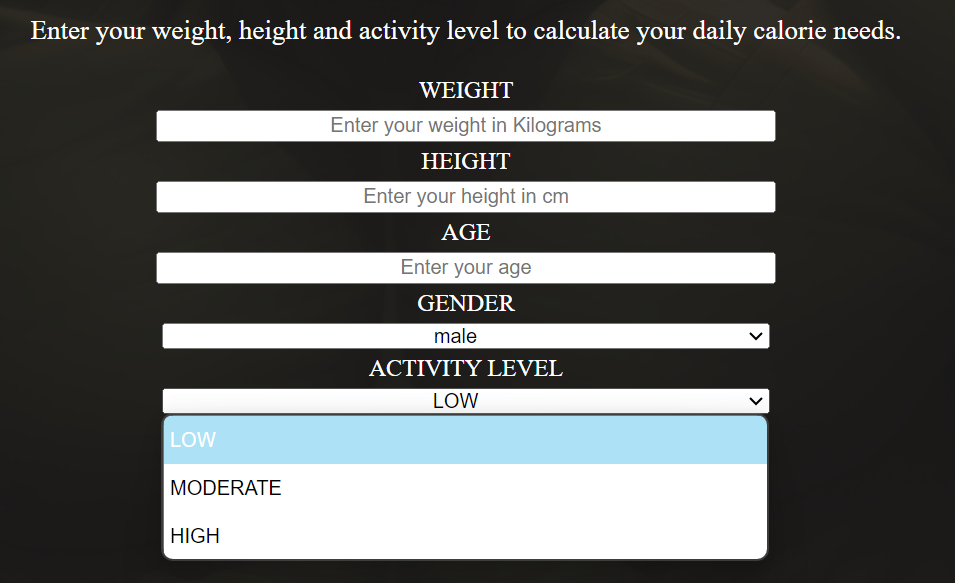
        
 

    - 

 Image for user story  

        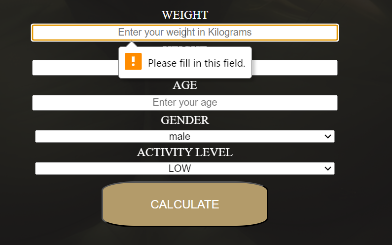
        
 

    - 

 Image for user story  

        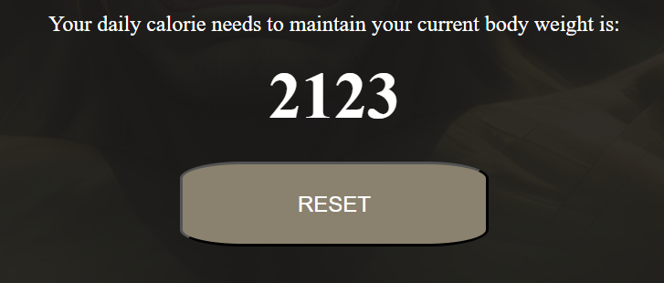
        
 

    - 

 Image for user story  

        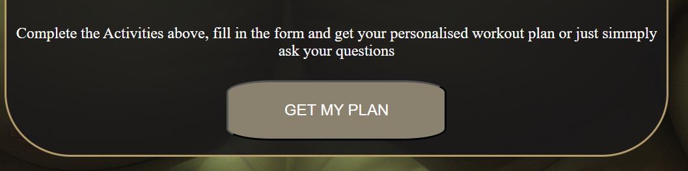
        
 

    2. User story 2:

        - As a gym enthusiast I am looking to gain more understanding of my body:
            1. I want to find out my body type to understand my training needs better
            2. I want to know my nutritional needs to help with diet
            3. I want to improve and get a personalised workout plan

#### Accesibility 

*   Accessibility was tested with google's lighthouse tool: The initial result was lower then expected and highlighted a couple of issue.
1. no label elements were added to associated select fields, this was rectified and the label fields were also added to all input fields in the calorie calculator to maintain a consistent look.
2. contrast ratio between the buttons and it's text. Investigated this issue and found that with the color pattern used the contrast checker would only pass dark text with good ratio. I've adjusted boldness and size to highlight the text but found swapping to a dark pattern unreasonable and decided against it. The overall accessibility score has still been significantly imrpoved and is now at a good level.

Accessibility before adjustments

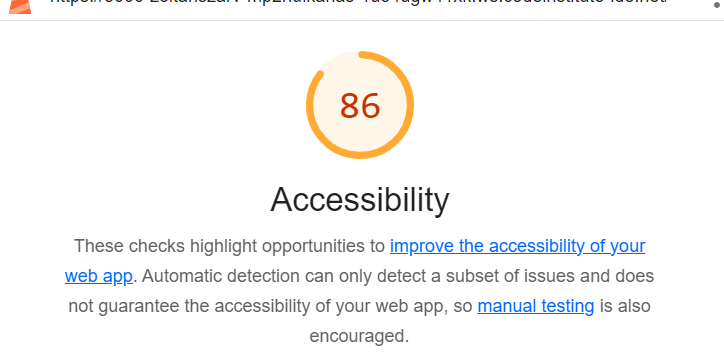

 

Accessibility after adjustment

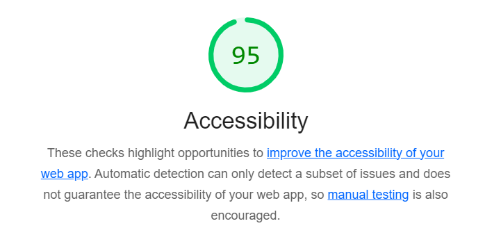

* Further Lighthouse Testing Results

Performance and Best Practises

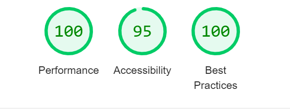

## Media 

* Pixabay: https://pixabay.com/images/search/webpage/

- https://pixabay.com/illustrations/ai-generated-hulk-superhero-mcu-8095123/
- https://pixabay.com/vectors/three-d-3d-abstract-art-male-1781596/

## Credits 

## Acknowledgement

My CodeInstitute Mentor: Alan Bushell 

For all the support and guidence given during the development of this Project
            
