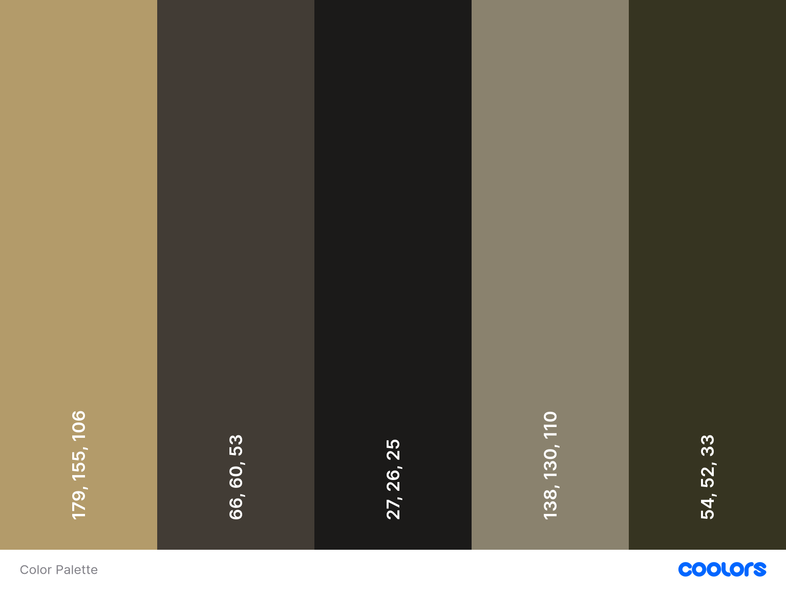
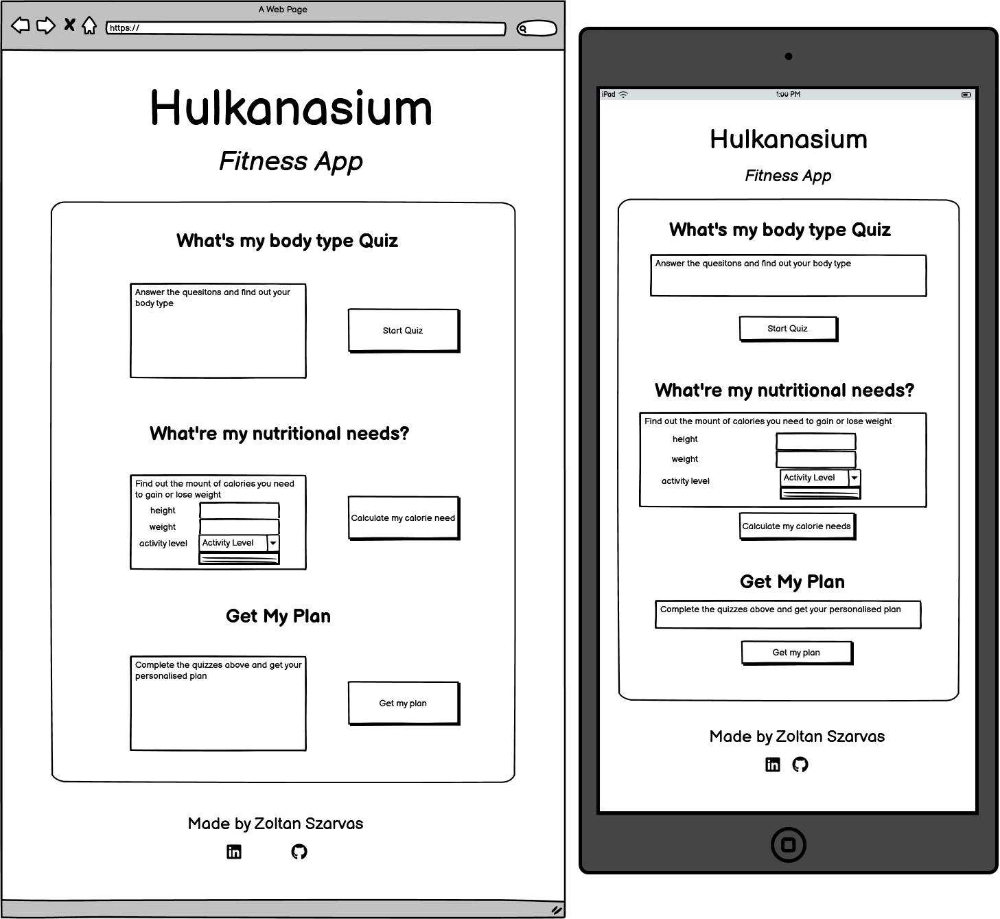
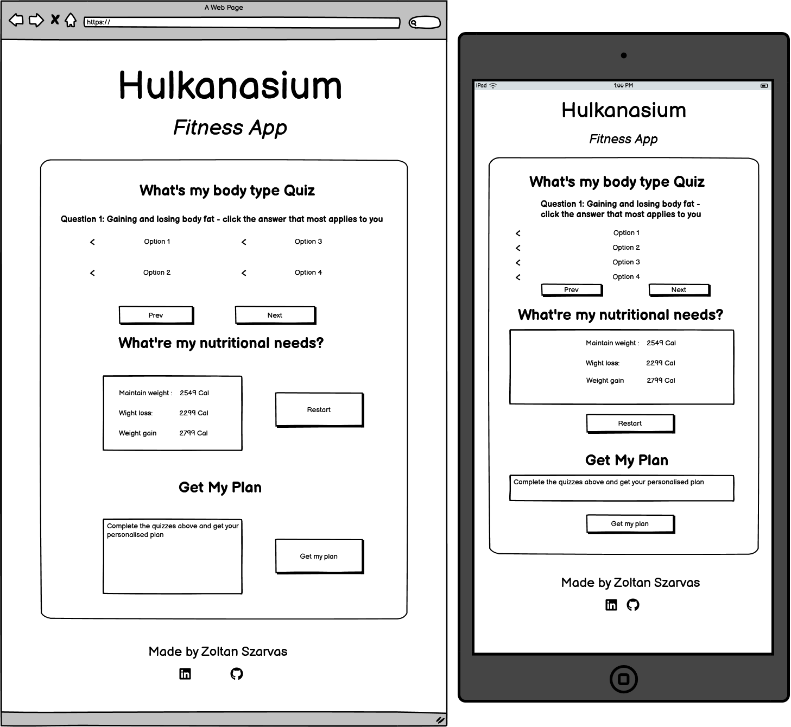
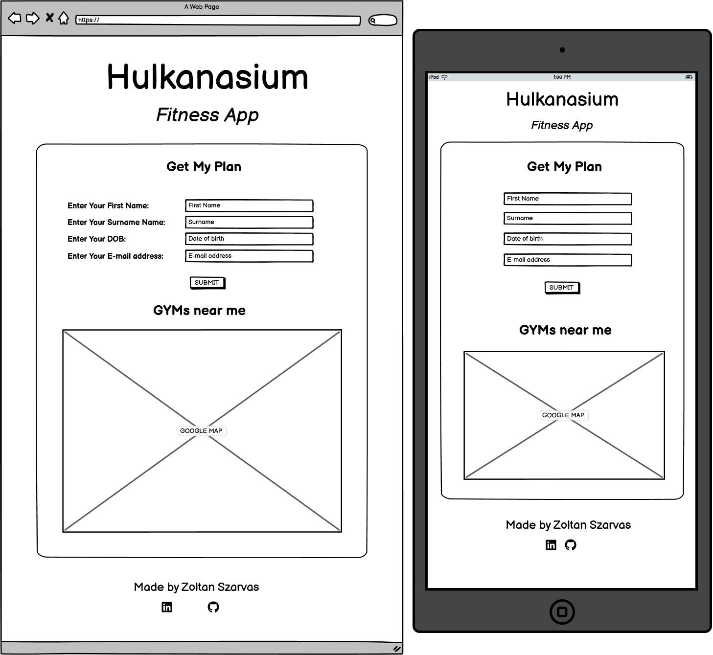
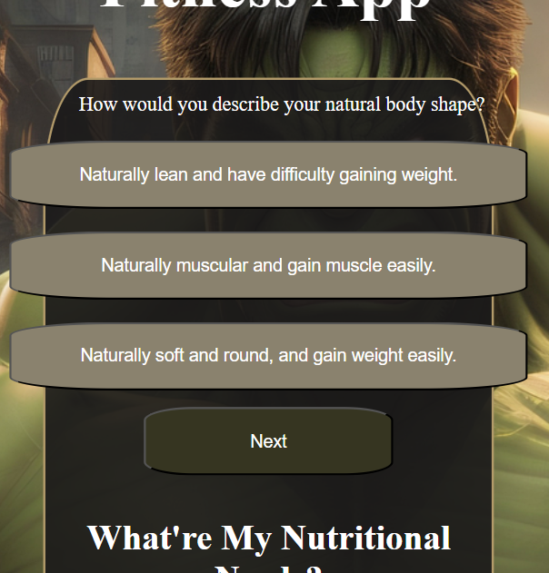
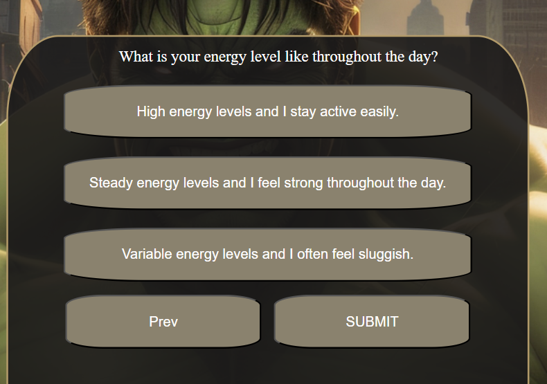
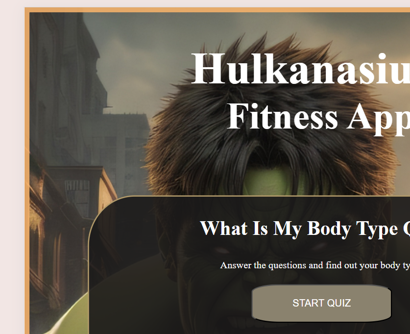
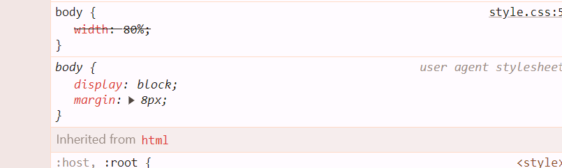

## Introduction

Hi there, 

Hulkanasium is a fictional fitness app created as the second Milestone Project for my studies with CodeInstitute. 

The idea of the site similarly to my first project is based on real life experience. The name Hulkanasium is fictional name my collegues and I come up with for a basement gym we had at a Hotel we all worked together in. The gym had a large Hulk picture in the middle that inspired the name. The second project of the web applications course requires the implementation of JavaSript along with html and css as it was in the previous project. To fulfill the requirement I decided to bring Hulkanasium alive and design a fitness application for it, where users can complete a quiz to find out their body type along with a calorie calculator and a form field to get a workout plan based on their results.

## **[ Hulkanasium Live Site ] (insert lin here)**

## **[Repository](insert link here)**

## Table of contents

 1. [ UX ](#ux)
 2. [ Technologies and Tools ](#technologies)  
 3. [ Objective ](#objective)  
 4. [ Research ](#research) 
 5. [ Target Audience ](#audience)  
 6. [ User Stories ](#user)
 7. [ Structure and Design ](#design)
     - [ Layout ](#layout)
     - [ Features ](#features)
     - [ Design Choices ](#designchoice)
     - [ Wireframes ](#wireframes)
 9. [ Deployment ](#deployment)
 10. [ Testing/Bugs/Fixes ](#testing)
     - [ HTML and CSS Validation](#htmlandcss)
     - [ Testing ](#alltesting)
          - [ Pre-deployment ](#predeployment)
          - [ post-deployment ](#postdeployment)
     - [ User Testing ](#usertest)
     - [ Accessibility ](#access)
 11. [ Media ](#media)
 12. [ Credits ](#credit)  

## UX 

The methology of UXD was used in the planning and development of the project. 
The choosen project is a fictional gym webapp that mimics some features of an ordinary webapp along with some added features to showcase use of JavaScript within the project. 

### Technologies and Tools Used 

* Languages

    * HTML
    * CSS
    * JavaScript

* Version Control

    * Git
    * Github
    * Gitpod

* additional resources

    * Coolors: https://coolors.co/ 
    * FontAwesome: https://fontawesome.com/search?o=r&m=free&s=solid
    * Perplexity: perplexity.ai
    * ChatGPT: https://chat.openai.com/

### Objective 

    * The objectives of the app is to promote health lifestyle and advertise the fictional gym Hulkanasium. Furthermore , the app is intended to be a tool for users to gain some general knowledge about their body type and nutrition needs.

### Research 

Extensive research took place before starting on the planing of the structure of the site. Visited several existing gym sites to find inspiration in design, test usability and find what is needed to fulfill user needs.

While the original idea was to develop a complete webpage , this was scrapped and changed to a fitness app as I found it fulfills the requirements for my second milestone project better.

During my research I focused on finding what most people would be comfortable with and came to realise that calorie intake is the basic "go to" when it comes to gaining/losing weight. I also figured that knowing "what you are" in terms of your body type is a must to be able to create specialised plans and therefore decided to implement these features.

Websites visited for research:

* [PureGym](https://www.puregym.com/)
* [Nuffield Helath](https://www.nuffieldhealth.com/gyms/bristol)
* [Healthline](https://www.healthline.com/health/quiz/quiz-whats-your-body-type)
* [Bodybuilding](https://www.bodybuilding.com/fun/macronutcal.htm)

### Target Audience 

The target audiance of the application is very broad. IT aims to help all looking to get fitter with the first steps. wether it is commiting to a plan or just starting to watch what you eat. Generally it includes people looking to lose weight as well as fitness enthusiasts looking to gain muscle. The app also helpful to anyone that just wants to find out the "numbers" and be more aware of their eating habbits.

### User Stories 

* User story 1:

    - As a user looking to lose weight and therefore find out nutritional needs:
        1. I want to find out what is my daily calorie need.
        2. I want to find out how it changes based on my activity level.
        3. I want to be able to get in touch to find out more.

* User story 2:

    - As a gym enthusiast I am looking to gain more understanding of my body:
        1. I want to find out my body type to understand my training needs better
        2. I want to know my nutritional needs to help with diet
        3. I want to improve and get a personalised workout plan

### Structure and Design 

* Layout:

I designed the app to be a simple 1 page site with all information presented straight away. The page breaks into 3 section with a simple structure of Header - Body - 
Footer.
- The header simple features the name of the app.
- The body is the main section of the project and it contains all interactive elements of the fitness app and therefore it can be broken down to 3 subsection:
    1. Body Type Quiz
    2. Calorie Calculator
    3. Get my plan
The 3 sections of the app was designed to fulfill the user stories of this simple app.
- The footer displays the author and the social links associated with me.

* Color Palette:   

The above color palette where generated using https://coolors.co/ free color generator and the background image of the application. I'va added a generic white color to use for text to provide a strong contrast with the scheme.

* Features:

1. Header
2. Main Page and background
3. Body Type Quiz
    1. Quiz
    2. Navigation
    3. Dynamic content
4. Calorie Calculator
    1. Main form
    2. Dynamic content
5. Get My Plan
    1. Start screen
    2. Pop-up form
    2. Thank you page
6. General UX features.
    1. Interactive buttons
    2. Visual feedback features

* Wireframes:

The original wireframes had a slightly different lay out then the final product. While initially planning the app I accounted for issues with the appearence of the features in different screen sizes. However, once code-ing started and I had the visuals in front of me I was happy with how it looked and decided there was no need to make mayor adjustments and therefore the layout stays the same consistently.

    - Few other adjustment were made during development:
        1. extended the form section of the Calorie Calculator section with additional input field and dropdown menu.
        2. decresed the amount of choices available for each multiple choice question.
        3. included a textarea in the Get My Plan section for the user to be able to write custome messages.
        4. scraped the seperate Get My Plan page idea and replaced it with a pop-up form

-   

 Wireframes: Home Default 

    
    

-   

 Wireframes: Home Active 

    
    

-   

 Wireframes: Get My Plan 

    
    

### Deployment 

To Deploy a project from your github repesatory, follow the steps below.

 1. Login to your GitHub account.
 2. Click on the repository you would like to deploy.
 3. Clcik Settings on the top navigation bar. 
 4. Then select Pages on the side navigation bar.
 5. Under Build and Deployment/ Source click on the first dropdown menu and select Deploy from a branch.
 6. Under branch click the first dropdown menu and select main.
 7. Under the second dropdown menu select /(root).
 8. Select Save.

    The github page now is alive!.

## Testing/Bugs/Fixes 

### HTML,CSS and JS validation: 

### Testing 

#### Initial testing items below arose during development and most were dealt with at the time.  

| **Feature** | **Test Method** | **Expectation** | **Outcome** |
|-------------|-----------------|-----------------|-------------|
| Header Responsivness | Developer Tools: 320px/375px/425px/768px/1024px/1440px | Fully Responsive Layout | PASS |
| Footer Responsiveness | Developer Tools: 320px/375px/425px/768px/1024px/1440px | Fully Responsive LAyout| PASS |
| Main Container Responsiveness | Developer Tools: 320px/375px/425px/768px/1024px/1440px | Fully Responsive LAyout| PASS |
| Body Type Quiz Responsiveness | Developer Tools: 320px/375px/425px/768px/1024px/1440px | Fully Responsive LAyout| FAIL(1) |
| Calorie Calculator Responsiveness | Developer Tools: 320px/375px/425px/768px/1024px/1440px | Fully Responsive LAyout| PASS |
| Get My Plan-Pop-up Responsiveness | Developer Tools: 320px/375px/425px/768px/1024px/1440px | Fully Responsive LAyout| PASS |

| **Feature** | **Test Method** | **Expectation** | **Outcome** |
|-------------|-----------------|-----------------|-------------|
| Navigation | Clciked and Tested Each Button Provided | Fully Interavtive Navigation Without Using Browser Buttons | PASS |
| UX - User Feedback - Buttons | Visually Checked All Expected Features | Background Color to Change and Appear as Expected | FAIL(2) |
| UX - User Feedback - Pop-ups | Visually Checked All Expected Features | Pop-Up Window to Appear as Expected | PASS |
| Layout | Visual inspection of all features | Match Design as Expected | Fail(3) |
| User Experience - Actions | Click and Test Each Feature Individually to assess behaviour | Each feature to Interactively React as Designed | FAIL(4) | 

 - Issues found during testing pre-deployment listed below:

 1. Quiz questions over extend when expanding onto tablet screen size( 768px) and overflow their container box. 
    - Investigating the issue with the help of Developer Tools I found that the media queries originally written to avoid this problem were insufficient.   
    I adjusted the code and the issue was resolved.

    

 Sceenshot of the problem: 

    
    
 

 2. On the last page of the quiz a dynamically submit button appears that do not macth the UX design pattern and does not appear darkened out(giving feedback to the user that it can not yet be clicked).
    - The issue is not yet resolved.

    

 Sceenshot of the problem: 

    
    
 

 3. The main container appers to be slightly out of alignment and the edge of the repeating background picture can be seen.
    - With the help of Developer Tools I found a pre-set margin of 8px was pushing the content out of alignment. I updated the css file to include a margin: 0px;
    for the body element. This resolved the alignment issue.

    

 Sceenshot of the problem: 

    
    
 
    

 Sceenshot of the problem: 

    
    

 4. Found that while the reset button provided for the quiz is taking you back to the quiz as expected, it land on the last question insted of the first.
    - The issue is not yet resolved.

 5. The Calorie Calculator's Calculate button would not work as expected. While the output was what I wanted, validation was an issue.
    - The original implementation had the input fields and dropdown menus embedded individually rathen than part of a form. That made html validation impossible.   
    To resolve this problem, I adjusted the html and included a form element that now had all required fields added. After the html validation was in place an event listener was attached to the Calculate Button to prevent defult action until the custom function written is carried out.
    The above changed resolved the issue.

#### At the end of the Project further testing took place to identify any shortcomings. See details below: 

| **Feature** | **Test Method** | **Expectation** | **Outcome** |
|-------------|-----------------|-----------------|-------------|
| | | | |

#### User Testing 
#### Accesibility 

## Media 

* Pixabay: https://pixabay.com/images/search/webpage/

- https://pixabay.com/illustrations/ai-generated-hulk-superhero-mcu-8095123/
- https://pixabay.com/vectors/three-d-3d-abstract-art-male-1781596/

## Credits 

## Acknowledgement

My CodeInstitute Mentor: Alan Bushell 

For all the support and guidence given during the development of this Project
            
